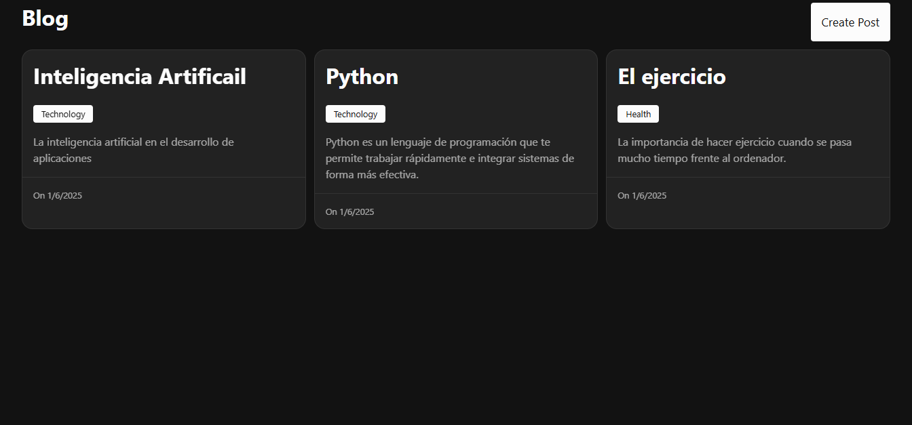
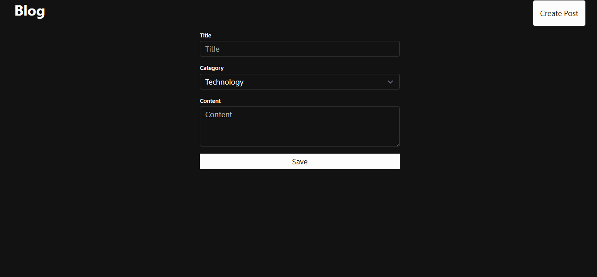
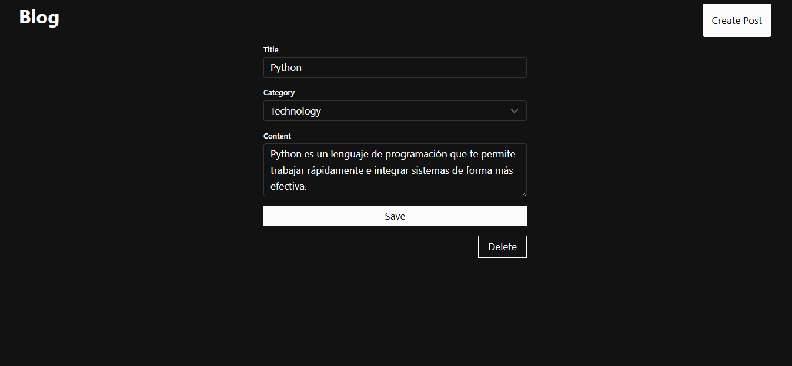

# Blog simple

Blog hecho con Django REST Framework, React, tailwind y skeleton

<table>
    <tr>
        <td>
            
        </td>
        <td>
            
        </td>
    </tr>
    <tr>
        <td>
            
        </td>
    </tr>
</table>